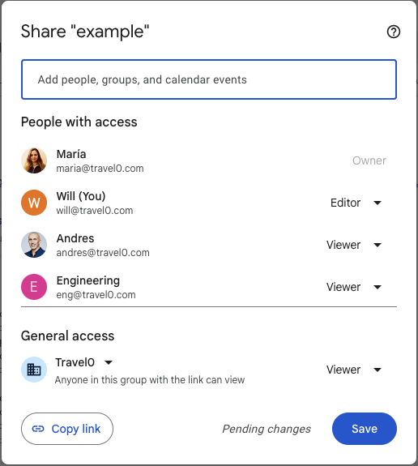

# Meta
[meta]: #meta
- Name: ListUsers and StreamedListUsers APIs
- Start Date: 2023-12-14
- Author(s): @jon-whit, @willvedd, @miparnisari
- Status: Approved <!-- Acceptable values: Draft, Approved, On Hold, Superseded -->
- RFC Pull Request: https://github.com/openfga/rfcs/pull/15
- Relevant Issues:
  - https://github.com/openfga/roadmap/issues/16 (main roadmap issue)
  - https://github.com/openfga/openfga/issues/406
  - https://github.com/openfga/openfga/issues/1215

- Supersedes: N/A

## Table of Contents 
- [Summary](#summary)
- [Definitions](#definitions)
- [Motivation](#motivation)
- [What it is](#what-it-is)
- [API Semantics](#api-semantics)
- [API and Server Configuration Changes](#api-and-server-configuration-changes)
- [How it Works](#how-it-works)
- [Algorithm](#algorithm)
- [Concurrency Control](#concurrency-control)
- [Out of Scope](#out-of-scope)
- [Pruning/Directing Expansion with Graph Edges](#pruningdirecting-expansion-with-graph-edges)
- [Migration](#migration)
- [Drawbacks](#drawbacks)
- [Alternatives](#alternatives)
- [Prior Art](#prior-art)
- [Open Questions](#open-questions)

## Summary
[summary]: #summary

The `ListUsers` API will provide an API that answers the question, **who are all the users that have a relationship with an object**?

More specifically, given an [object](https://openfga.dev/docs/concepts#what-is-an-object), the `ListUsers` API will return all of the concrete/terminal [user](https://openfga.dev/docs/concepts#what-is-a-user) subjects that have a [relationship](https://openfga.dev/docs/concepts#what-is-a-relation) with that object.


## Definitions
[definitions]: #definitions

* You may see references to strings formatted as **`object#relation@user`** in this document. This is short-hand notation for representing an OpenFGA Relationship Tuple. For example, `group:eng#member@user:jon` or `document:1#viewer@group:eng#member` etc.. You may also see strings formatted as `objectType#relation`. This is short-hand notation for representing a specific relation defined on some object type. For example, `document#viewer` represents the viewer relationship defined on the document object type.

* **Expansion** - refers to the process of iteratively traversing the graph of relationships that are realized through both an OpenFGA model AND the relationship tuples that exist in the store.

* **Forward expansion** - refers to expansion of the OpenFGA relationship graph in a forward form. That is, starting at an object and relation, walk the graph of relationships in a directed way towards a user of some specific type by following paths that would lead through some target relation.

* **Reverse expansion** - refers to expansion of the OpenFGA relationship grpah in a backwards form. That is, starting at a user of a specific type, walk the graph of relationships in a directed way towards an object of some specific type by following paths that would lead through some target relation.

* **Concrete/terminal objects** - a concrete or terminal object refers to a singular or specific resource of a given object type and id. A concrete object cannot be expanded any further (see Expansion above). It can be conceptualized as a leaf-node in a graph. Concrete objects differ from usersets, because usersets refer to a collection of zero or more concrete objects. For example `user:jon` is a concrete object while `group:eng#member` is a userset which may expand to multiple concrete objects such as `user:jon`, `user:andres`, etc..

* **Userset** - A userset refers to a set of zero or more concrete objects that are the subjects that a relationship expands to. See our Concepts page on [Users](https://openfga.dev/docs/concepts#what-is-a-user) for more info.


## Motivation
[motivation]: #motivation

Developers using OpenFGA want to look up all of the users that have a particular relationship with an object. 

### Use Cases

- **UIs** - Display the users that a resource has been shared with. Ex: the "Share" dialog in Google Docs.
- **Notifications** - Notify all users who relate to a specific object. Ex: send and email to editors of a document when it has been updated.

### Expected Outcome

Two new core APIs are added to the [OpenFGA API](https://github.com/openfga/api) and implementations of these new APIs in the [OpenFGA server](https://github.com/openfga/openfga).

## What it is
[what-it-is]: #what-it-is

Given an `object`, `relation`, and one or more user/subject provided filters, return the concrete/terminal set of user objects matching at least one of the user filters that have that relationship with the object.

More formally, given the following model and relationship tuples:

```
model
  schema 1.1

type user
type cat

type group
  relations
    define member: [user, group#member]

type document
  relations
    define viewer: [cat, user, group#member]
```

| object     | relation | user             | condition_name | context |
|------------|----------|------------------|----------------|---------|
| document:1 | viewer   | user:anne        | null           | null    |
| document:1 | viewer   | group:eng#member | null           | null    |
| group:eng  | member   | group:fga#member | null           | null    |
| group:fga  | member   | user:jon         | null           | null    |

ListUsers and StreamedListUsers would behave as follows:

> ℹ️ For the sake of brevity the examples below focus on the ListUsers unary RPC variant. The difference with the StreamedListUsers API is the streaming semantics of the response. Instead of returning an array, the streaming variant returns each result one at a time as they are "discovered".

**Example 1**
`user` object types are both directly and indirectly related to `document#viewer` relationships. The indirect relationships come through the direct relationships involving `group#member` (e.g. users can directly view a document or if the user is part of a group that can view the document)
```
ListUsers({
    object: "document:1",
    relation: "viewer",
    user_filters: [{type: "user"}]
}) --> 
{
  users: [],
  wildcard_types: ["user:anne", "user:jon"]
}
```

**Example 2**
Looking at the type restrictions defined in the model, `group` objects are not directly related whatsoever to `document#viewer` relationships. So this example returns no results.
```
ListUsers({
    object: "document:1",
    relation: "viewer",
    user_filter: [{type: "group"}]
}) --> {
  users: [],
  wildcard_types: []
}
```

**Example 3**
You can see in the model that `group#member` relationships are directly related to `document#viewer`. So this example returns the `group:eng#member` direct relationship and the `group:fga#member` relationship indirectly through `group:eng#member`.
```
ListUsers({
    object: "document:1",
    relation: "viewer",
    user_filter: [
      {
        type: "group",
        relation: "member"
      }
    ]
}) --> 
{
  users: ["group:eng", "group:fga"]
  wildcard_types: []
}
```

## API Semantics
Unless otherwise noted, the intent is for the `ListUsers` and `StreamedListUsers` APIs to behave similarly with the `ListObjects` and `StreamedListObjects` API. This is to encourage more uniformity in the API experience. The API and server configuration should reflect similarities, the error propagation strategy should strive to be the same, and any limits and/or deadline behaviors should strive to be identical unless there is a compelling reason to have an exception. We may find such compelling reasons as we dig into the implementation details further, but it's not obvious why/if it would have to differ at this time.

## API and Server Configuration Changes
- Introduce the new protobuf API definitions.

  > ℹ️ The various protobuf annotations have been omitted for brevity, but assume they are identical to those existing annotations for the same or similar fields used in other endpoints.
  
    - **ListUsers**
    
    ```protobuf
    rpc ListUsers(ListUsersRequest) returns (ListUsersResponse)
    
    message ListUsersRequest {
        string store_id = 1;
        string authorization_model_id = 2;
        string object = 3;
        string relation = 4;
        repeated RelationReference user_filter = 5;
        repeated TupleKey contextual_tuples = 6;
        google.protobuf.Struct context = 7;
    }
    
    // ListUsersResponse represents a unary response with
    // all user result(s) up to the maximum limit.
    message ListUsersResponse {
      repeated string users = 1; // e.g. document:1
    }
    ```
    
    The `user_filter` defines an array of [RelationReference](https://github.com/openfga/api/blob/c491fa728f66c961fd17f5d7dfd491be197b343e/openfga/v1/authzmodel.proto#L90) (e.g. type restriction definitions) that will be used to control the expansion. As ListUsers expansion occurs, if we find a user/subject that meets one of the user_filter type restriction(s), then we include the result in the response and stop further expansion on that subproblem. Once we've found a result meeting the filter criteria we don't explore that subproblem any further, even if it would lead to more results matching the other filters in the `user_filter` (see Example 5 below for further details).

    - **StreamedListUsers**
    
    ```go
    rpc StreamedListUsers(StreamedListUsersRequest) returns (stream StreamedListUsersResponse)
    
    message StreamedListUsersRequest {
        string store_id = 1;
        string authorization_model_id = 2;
        string object = 3;
        string relation = 4;
        repeated RelationReference user_filter = 5;
        repeated TupleKey contextual_tuples = 6;
        google.protobuf.Struct context = 7;
    }
    
    // StreamedListUsersResponse represents a single streaming user result 
    // returned from the streaming endpoint.
    message StreamedListUsersResponse {        
      string user = 1; // e.g. document:1
    }
    ```
    
- New server configurations (flags/config/env):

  - `--listUsers-max-results (uint32)` - limits the maximum size of the results returned by ListUsers (if 0 all results are returned up to the deadline, otherwise the response is limited to this size)

  - `--listUsers-deadline (duration)` - the timeout deadline for serving ListUsers or StreamedListUsers requests (default 3s)

  - `--max-concurrent-reads-for-list-objects (uint32)` - the maximum allowed number of concurrent datastore reads in a single ListUsers or StreamedListUsers query

### Limits and Deadlines
The `ListUsers` API is a [unary RPC](https://grpc.io/docs/what-is-grpc/core-concepts/#unary-rpc) while the `StreamedListUsers` is a [server-streaming RPC](https://grpc.io/docs/what-is-grpc/core-concepts/#server-streaming-rpc). Because of these semantic differences we have different behaviors around limits and deadlines. 

The server flag `--listUsers-deadline` (mentioned above) sets an overall upper limit on the amount of time (e.g. the deadline) for serving a `ListUsers` or `StreamedListUsers` request. It controls how long time can be spent expanding results (e.g. finding relationships in the graph). If there are very few results and the deadline is generous, then the request will respond earlier than the deadline period. However, if there are many results and returning all of them would take longer then the deadline, then only the subset that can be returned in the deadline period are returned.

The server flag `--listUsers-max-results` (mentioned above) will limit the size of the set of results return from the unary `ListUsers` endpoint. It sets a hard upper limit on how many results can be returned. If the actual result set is less than this limit then the subset *should* be promptly returned so as to avoid keeping the client waiting longer than necessary. If the actual result set is at least as large as the max results limit but the results haven't been computed before the `--listUsers-deadline` period, then only the results which have been computed up to that deadline will be returned.

### Error Handling
ListUsers and StreamedListUsers should strive to implement error handling semantics inline with the way ListObjects and StreamedListObjects do. Namely, the API  should strive to fulfill the request with its limits as much as possible. For the unary ListUsers endpoint, if and only if it cannot fulfill the requested `--listUsers-max-results` and at least one error occurred, then an error should be surfaced. For the StreamedListUsers endpoint, as errors are encountered they should be yielded over the stream.

### Typed Public Wildcard

Special treatment is given to typed wildcards that match the criteria of a ListUsers query. Because they are not "users" in a normal sense, their results are separated from specific ID'd users with a dedicated `wildcard_types` property in the response body. This separation enables easier parsing of users and allows developers to handle the wildcard case to their specific needs.

```go
type user
type employee

type document
  relations
    define viewer: [user:*, employee:*]
```

| object     | relation | user            |
|------------|----------|-----------------|
| document:1 | viewer   | user:*          |
| document:1 | viewer   | employee:*      |

**Example 1:**

```
ListUsers({
  object: "document:1",
  relation: "viewer",
  user_filter: [
    {
      type: "user",
    }
  ]
}) --> {
  wildcard_types: ["user"]
  users: [],
}
```
In example 1, there are two tuples establishing a typed wildcard, one for `user` and `employee`, both with `document:1#viewer`. But while expanding the ListUsers request we only return the `user` type in the `wildcard_types` property because it is the only tuple that matches the filters in the `user_filter`.


**Example 2:**

```
ListUsers({
  object: "document:1",
  relation: "viewer",
  user_filter: [
    {
      type: "user",
    }
    {
      type: "employee",
    }
  ]
}) --> {
  wildcard_types: ["user","employee"]
  users: [],
}
```
However, in example 2, both `user` and `employee` typed wildcard are returned because those user types were specified in the `user_filter` input field.

## How it Works
[how-it-works]: #how-it-works

## Algorithm

`ListUsers` and `StreamedListUsers` is a filtered form of recursive [Expand](https://openfga.dev/api/service#/Relationship%20Queries/Expand). We don’t want to return *all users of any type*, we only want to return all the concrete user objects *of a specified type*.

The implementation of ListUsers and StreamedListUsers will behave a lot like [ListObjects](https://openfga.dev/api/service#/Relationship%20Queries/ListObjects) and [StreamedListObjects](https://openfga.dev/api/service#/Relationship%20Queries/StreamedListObjects), but instead of starting at a user and expanding backwards (e.g. reverse expansion) we will start at a relationship with an object and recursively expand (forward expansion) any usersets we find along the way that would lead to a concrete/terminal object matching one of the specific user filters.


> ℹ️ Most of the implementation details we spent time tuning with `ListObjects` apply to this problem as well. Namely, bounding the number of concurrent evaluation paths, bounding the number of concurrent database queries that can be inflight per request, constraining the response results and/or the streaming deadline, etc.. We should be able to move more quickly on the implementation phase as a result of the prior work and education from ListObjects.

Here’s are a few examples to demonstrate the algorithm:

### Example 1a (Direct Relation with Object)
```
model
  schema 1.1

type user

type document
  relations
    define viewer: [user]
```

| object     | relation | user        |
|------------|----------|-------------|
| document:1 | viewer   | user:jon    |
| document:1 | viewer   | user:andres |


```
ListUsers({
  object: "document:1",
  relation: "viewer",
  user_filter: [{type: "user"}]
}) --> {
  users: ["user:jon", "user:andres"],
  wildcard_types: []
}
```
In this case the algorithm simply must expand all direct relationships between `document:1#viewer` and `user` objects. Since these are directly related to one another, then we must only do a simple reverse database lookup.

### Example 1b (Direct Relation with Userset)
```
model
  schema 1.1

type user

type group
  relations
    define member: [user, group#member]

type document
  relations
    define viewer: [group#member]
```
| object         | relation | user                  |
|----------------|----------|-----------------------|
| document:1     | viewer   | group:eng#member      |
| group:eng      | member   | group:fga#member      |
| group:fga      | member   | user:andres           |
| group:fga      | member   | group:fga-core#member |
| group:fga-core | member   | user:jon              |

```
ListUsers({
  object: "document:1",
  relation: "viewer",
  user_filter: [{type: "user"}]
}) --> ["user:jon", "user:andres"]
```
This example requires recursive expansion.
> ℹ️ The usage of `expand` from here forward refers to an internal expand function, and it should not be confused with the public Expand API, but it operates somewhat similarly.


1. Expand the set of subjects/users that relate to `document:1#viewer`. 

   `expand(document:1#viewer)` --> ["group:eng#member"]

1. Expand the new set of subjects/users that make up `group:eng#member` set.

   `expand(group:eng#member)` --> ["group:fga#member"]

1. Expand the set of subjects/users that make up the `group:fga#member` set.

   `expand(group:fga#member)` --> ["user:andres", "group:fga-core#member"]

   1. We find a terminal/concrete object of `user:andres`, which matches the `user` in the user filter, and so we add it to the list of items to include in the response.

1. Continue expanding the residual set of subjects/users in `group:fga-core#member`

   `expand(group:fga-core#member)` --> ["user:jon"]

   1. We find a terminal/concrete object of `user:jon`, which matches the `user` in the user filter, so add it to the list of items to include in the response

1. No further subjects to expand, and so we're done. Return the items we accumulated from the steps above.

Visually, the overall recursive call tree looks like the following:

```
expand(document:1#viewer) --> ["group:eng#member"]
|-> expand(group:eng#member) --> ["group:fga#member"]
|---> expand(group:fga#member) --> ["user:andres", "group:fga-core#member"]
      yield "user:andres"
|-----> expand(group:fga-core#member) --> ["user:jon"]
        yield "user:jon"

return ["user:andres", "user:jon"]
```

### Example 1c (Direct Relation with Typed Public Wildcard)
See [Typed Public Wildcard](#typed-public-wildcard) section for more context.

```
model
  schema 1.1

type user

type document
  relations
    define viewer: [user:*]
```
| object     | relation | user   |
|------------|----------|--------|
| document:1 | viewer   | user:* |

```
ListUsers({
  object: "document:1",
  relation: "viewer",
  user_filter: [
    {
      type: "user"
    }
  ]
}) --> {
  users: ["user"],
  wildcard_types: []
}
```

1. Expand the set of subjects/users that relate to `document:1#viewer`.

   `expand(document:1#viewer)` --> ["user:*"]

    1. We find a terminal/concrete wildcard of `user:*`, which matches the `user:*` in the user filter, and so we add it to the list of items to include in the response.

1. No further subjects to expand, and so we're done. Return the items we accumulated from the steps above.

Visually, the overall recursive call tree looks like the following:

```
expand(document:1#viewer) --> ["user:*"]
  yield "user:*"

return ["user:*"]
```

### Example 2 (Computed Relationship)
```
model
  schema 1.1

type user
type person

type document
  relations
    define editor: [user, person]
    define viewer: editor
```
| object     | relation | user       |
|------------|----------|------------|
| document:1 | editor   | user:jon   |
| document:1 | editor   | person:bob |

```
ListUsers({
  object: "document:1",
  relation: "viewer",
  user_filter: [{type: "user"}]
}) --> {
  users: ["user:jon"],
  wildcard_types: []
}
```
This example demonstrates a simple rewritten relation involved in the expansion. Instead of expanding `document:1#viewer` we immediately rewrite that to `document:1#editor` and expand that. Namely,

1. Rewrite document#viewer to document#editor through computed_userset.

   `expand(document:1#viewer)` --rewritten--> `expand(document:1#editor)`

1. Expand the new (rewritten) relationship.

   `expand(document:1#editor)` --> ["user:jon", "person:bob"]

   1. We find terminal/concrete objects including `user:jon` and `person:bob`. `user:jon` matches the `user` in the user filter, so add it to the list of items to include in the response, but we filter out/omit `person:bob`.

1. No further subjects to expand, and so we're done. Return the items we accumulated from the steps above.

Visually, the overall recursive call tree looks like the following:
```
expand(document:1#viewer) (rewritten)
|-> expand(document:1#editor) --> ["user:jon", "person:bob"]
    filter(["user:jon", "person:bob"])
    yield "user:jon"

return ["user:jon"]
```

### Example 3 (TTU Relationship)
```
type user

type folder
  relations
    define viewer: [user]

type document
  relations
   define parent: [folder]
   define viewer: viewer from parent
```
| object     | relation | user     |
|------------|----------|----------|
| document:1 | parent   | folder:x |
| folder:x   | viewer   | user:jon |

```
ListUsers({
  object: "document:1",
  relation: "viewer",
  user_filter: [{type: "user"}]
})  --> {
  users: ["user:jon"],
  wildcard_types: []
}
```

1. Rewrite document#viewer through tuple_to_userset (TTU).

   `expand(document:1#viewer)` --rewritten--> `expandTTU(document:1#viewer)`

1. Lookup the `document:1#parent` tupleset relationship.

   `storage#Read(document:1#parent)` --> ["folder:x"]

1. Expand the computed relation `viewer` of the TTU for each of the tupleset relationships found above. In this case we have to expand `folder:x#viewer`.

   `expand(folder:x#viewer)` --> ["user:jon"]

   1. We find terminal/concrete object `user:jon`, which matches the `user` in the user filter, so add it to the list of items to include in the response.

1. No further subjects to expand, and so we're done. Return the items we accumulated from the steps above.

Visually, the overall recursive call tree looks like the following:

```
expand(document:1#viewer)
|-> expandTTU(document:1#viewer)
|---> storage#Read(document:1#parent) --> ["folder:x"]
|---> expand(folder:x#viewer) --> ["user:jon"]
      yield "user:jon"

return ["user:jon"]
```

### Example 4 (Expanding Relationships With `objectType#relation`)
This example is a unique one in that it demonstrates a corner case to the algorithm. In the [API and Server Configuration Changes](#api-and-server-configuration-changes) section earlier we said the following:

> As ListUsers expansion occurs, if we find a user/subject that meets one of the `user_filter`` type restriction(s), then we include the result in the response and <u>stop further expansion on that subproblem</u>.

This examples demonstrates one corner case where we must continue expansion, but only if the subproblem would potentially expand to the same target type and relation of that which was found. 

Consider the following model and tuples:

```
model
  schema 1.1

type user

type group
  relations
    define member: [user, group#member]

type document
  relations
    define viewer: [group#member]
```
| object     | relation | user             |
|------------|----------|------------------|
| document:1 | viewer   | group:eng#member |
| group:eng  | member   | group:fga#member |
```
ListUsers({
  object: "document:1",
  relation: "viewer",
  user_filter: [
    {
      type: "group",
      relation: "member"
    }
  ]
}) --> {
  users: ["group:eng", "group:fga"],
  wildcard_types: []
}
```
This example deviates from many of the examples above in that we expand all relationships for a specific object and relation (e.g. `document:1#viewer`) that are related to a given set of users or subject set (e.g. `group#member`).

1. Expand the set of subjects/users that relate to `document:1#viewer`.

   `expand(document:1#viewer)` --> ["group:eng#member"]

   1. We find `group:eng#member`, which matches the `group#member` in the user filter, so add `group:eng` to the list of items in the response.

1. Even though we found `group:eng#member` and it matched the `group#member` user filter, we continue expanding the set of subjects/users that relate to `group:eng#member` because `group#member` is related to `group#member` and thus there may be more nested groups matching the specific filter.

   `expand(group:eng#member)` --> ["group:fga#member"]

    1. We find `group:fga#member`, which matches the `group#member` in the user filter, so add `group:fga` to the list of items in the response.

1. Again, we continue expansion because we may find more specific nested groups that relate to `group:fga#member`.

   `expand(group:fga#member)` --> []

1. No further subjects to expand, and so we're done. Return the items we accumulated from the steps above.

Visually, the overall recursive call tree looks like the following:
```
expand(document:1#viewer) --> ["group:eng#member"]
yield group:eng
|-> expand(group:eng#member) --> ["group:fga#member"]
    yield group:fga
|---> expand(group:fga#member) --> []

return ["group:eng", "group:fga"]
```

### Intersection and Exclusion
For relationships that involve an intersection (e.g. `a and b`) or exclusion (e.g. `a but not b`) we'll apply the same algorithmic approach we do in ListObjects. Namely, given the set `a and b` we'll compute `a` and then call `Check` for each of the results to resolve the set intersection through Check resolution. Likewise, for `a but not b` we'll compute `a` and then call `Check` for each of the results to resolve the set difference.

This choice is an algorithmic choice that exploits the fact that `a and b` and `a but not b` can be no larger than the `max(size(a), size(b))`, so instead of computing the results for both sets, holding the results temporarily in memory and then resolving the overlap, we simply compute the first set and then use Check resolution to resolve the residual.

## Concurrency Control
Similar to the mitigations we've implemented in Check and ListObjects, a single ListUsers subproblem could fan-out to hundreds or more of repetitive expansions. Consequently, we must limit the breadth of the number of expansions that can be dispatched at any level as well as limit the total depth of expansion. 

For widely nested sets of relationship, consider the following model and relationship tuples:

```
model
  schema 1.1

type user

type group
  relations
    define member: [user, group#member]
```
| object  | relation | user           |
|---------|----------|----------------|
| group:1 | member   | group:2#member |
| group:1 | member   | group:3#member |
| group:1 | member   | ...            |
| group:1 | member   | group:N#member |
| group:N | member   | user:jon       |

If a developer were to call 
```
ListUsers({
  object: "group:1",
  relation: "member",
  user_filter: [{type: "user"}]
})
```
then, for large `N`, this would cause a high degree of expansive breadth and saturate the server CPU and memory.

Similarly, for recursively expanding deeply nested sets, consider the same model above but the following tuples:
| object  | relation | user           |
|---------|----------|----------------|
| group:1 | member   | group:2#member |
| group:2 | member   | group:3#member |
| ...     | member   | ...            |
| group:N | member   | user:jon       |

If a developer were to call
```
ListUsers({
  object: "group:1",
  relation: "member",
  user_filter: [{type: "user"}]
})
```
then, for large `N`, this would cause a high degree of depth and saturate the server CPU and memory.

## Pruning/Directing Expansion with Graph Edges
> ℹ️ Failure to prune expansion could lead to more excessive server exhaustion and be a reliability and performance concern.

A naive implementation would blindly expand subject/user sets without using any of the type restriction information included in the model (e.g. neglecting concrete edges in the graph). A more optimized approach to the iterative expansion algorithm described above would use the type restriction information to prune the expansion space. For example, consider the following model and relationship tuples:

```
model
  schema 1.1

type person
type user

type group
  relations
    define member: [person, group#member]

type document
  relations
    define viewer: [group#member]
```

| object     | relation | user           |
|------------|----------|----------------|
| document:1 | viewer   | group:1#member |
| document:1 | viewer   | group:2#member |
| document:1 | viewer   | ...            |
| document:1 | viewer   | group:N#member |
| group:N    | member   | person:bob     |

If a developer were to call
```
ListUsers({
  object: "document:1",
  relation: "viewer",
  user_filter: [{type: "user"}]
})
```
then a naive implementation would start expanding all `group#member` relationships only to find that `user` objects aren't related to any group members. This is because the type restrictions would not allow such relationships to exist in the first place. In this case, if `N` is large, this is a server concern. Consequently, we should avoiding expanding edges that would not lead to a terminal object that matches one of the targets in the provided `user_filter` list. We can do so by using the relationship edges information we have available in the OpenFGA typesystem.

## Out of Scope

The following API features were considered been deemed out-of-scope for the initial development of `ListUsers`.

### Resolved Paths
Resolved paths answer the question of how a user is related to an object. The following example showcases the potential behavior of resolved paths in `ListUsers` and how the API behaves when multiple target user filters are provided. 

This behavior enables experiences similar to that you get in Google Docs when you open the Share dialog.



We'll use the following model and tuples for this example:
```
type user

type organization
  relations
    define member: [group#member]

type group
  relations
    define member: [user, group#member]

type folder
  relations
    define viewer: [user]

type document
  relations
    define parent: [folder]
    define owner: [user]
    define editor: [user, group#member] or owner
    define viewer: [user, group#member] or editor or viewer from parent
```
| object                  | relation | user                           |
|-------------------------|----------|--------------------------------|
| document:example        | owner    | user:maria                     |
| document:example        | editor   | user:will                      |
| document:example        | parent   | folder:x                       |
| folder:x                | viewer   | user:andres                    |
| document:example        | viewer   | group:engineering#member       |
| group:engineering       | member   | user:will                      | 
| document:example        | viewer   | user:*                         |

The dialog display has two unique sections "People with access" and "General access", and these different sections distinguish between access that has been shared with specific individual end-users and/or groups of end-users versus access that has been broadly shared to anyone in the org (e.g. a wildcard scoped to an org context).

To handle this Google Doc Share Dialog use case we'd call `ListUsers` twice, one for each section of the dialog.

To render the "People with access" section we'd make the following query:
```
ListUsers({
  object: "document:example",
  relation: "viewer",
  user_filter: [
    {
      type: "user"
    },
    {
      type: "group",
      relation: "member"
    }
  ]
}) --> {
  users: [
    {
      user: "user:maria",
      resolved_paths: [
        {
          "object": "document:example",
          "relation": "owner"
        }
      ]
    },
    {
      user: "user:will",
      resolved_paths: [
        {
          "object": "document:example",
          "relation": "editor"
        }
      ]
    },
    {
      user: "user:andres",
      resolved_paths: [
        {
          "object": "folder:x",
          "relation": "viewer"
        }
      ]
    },
    {
      user: "group:engineering",
      resolved_paths: [
        {
          "object": "document:example",
          "relation": "viewer"
        }
      ]
    }
  ],
  wildcard_types: ["user"]
}
```
Two things are important to point out about this response:

1. We didn't return `user:will` twice, because once we find the group `group:engineering#member`, which this user is apart of, we stop expanding that group because it matches one of the provided `user_filter` inputs, namely the `group#member` filter. So in this case for this user we only return the computed relation that stems from the `document:example#editor` resolution path.

2. Notice the usage of the relation 'viewer' in the request. This relation is the greatest common denominator of the relations included in the list of permissions in the UI dialog next to each user/subject's name. Here's how to interpret the response and how the Google Docs app would use the response to build the UI:

    - Since `user:maria` is the owner we find resolution paths stemming from `document:example#editor` and `document:example#viewer` thus leading to `document:example#viewer`. The Google Doc Share Dialog chooses to prioritize the highest permission in the UI dropdown boxes, so in this case the UI shows the `owner` relation next to `user:maria`

     - Likewise, since `user:will` is assigned `document:example#editor` which has a computed relationship to `document:example#viewer`. So in this case the UI shows the `editor` relation next to `user:will`

    - `user:andres` can view the parent folder `folder:x`, and thus we find a resolution path to `document:example#viewer` through `folder:x#viewer`. The Google Doc Share Dialog chooses to render the inherited permission `document#viewer` based on this resolution path.

    - The set of users/subjects included in `group:engineering` have editor acces, and thus we find a resolution path stemming from `document:example#viewer` that leads to `document:example#viewer`. The Google Doc Share Dialog chooses to render group memberships such as this as the Google Group and the highest permission that set of subjects has, which is `viewer` in this case.

3. The `user` type wildcard is returned in the `wildcard_types` portion of the response. This special treatment lends nicely to the Google Doc Share example, which has a visually unique treatment.

This response indicates to the Google Docs apps that viewer permissions to `document:example` have been explicitly granted to any object of type `user`, and then the app can use this to implement a link-based sharing mechanism.

### Multiple Target Relations

The ability to specify multiple target relations was considered. This would have enabled developers to display users who had a variety of relations to a specific object. Supporting this would have introduced performance concerns and all the existing endpoints operate on a single-relation basis, which would have made this behavior inconsistent. 

## Migration
[migration]: #migration

* No migrations or API breaking changes should be necessary for this work. We're extending the API surface, not changing it.

## Drawbacks
[drawbacks]: #drawbacks

* Increases API surface to maintain

* Another costly graph traversal query - when we added ListObjects and StreamedListObjects we had to work through some reliability improvements to ensure these new APIs didn't exhaust the database connection pool. These same considerations will be very relevant to this work as well.

## Alternatives
[alternatives]: #alternatives

- The client calls Check for every user in the system for the given `object` and `relation`

This is *an option*, but it is not one that is conducive to performance and/or handling more queries at scale. If many OpenFGA clients used Check for this pattern, then the server would have to be scaled up pretty high during more normal operation to account for this burst load. Additionally, it is also more challenging for a client to orchestrate this many Checks since we do not have a BatchCheck mechanism at this time.

- Naive server implementation which queries all subjects/users in the system that match the target subject/user filter and for each of them call Check on the provided `object` and `relation` (e.g. server-side BatchCheck naive implementation).

A preliminary implementation spike revealed that this approach would not cater to various of the use cases we explored including the Google Share Dialog that is discussed in more depth above in [Resolved Paths](#resolved-paths). For this reason and for performance concerns (e.g. the volume of Checks that would have to occur) we do not feel this is a viable approach.

- Encourage clients to implement Expand recursively themselves

There’s nothing stopping clients from implementing ListUsers today using the existing `Expand` API, and we won’t necessarily discourage it even after we implement ListUsers. However, we want to build ListUsers to provide this API more natively in the API offering and thus reduce duplication across the community and the burden on the client. We want to provide developers in the community with a simple to use API that doesn’t require reimplementing this logic anywhere it is needed. I anticipate the community will build API endpoints providing recursive Expand for this use case, and so we may as well offer it natively in the API.

## Prior Art
[prior-art]: #prior-art

The following code implements a POC implementation of `ListUsers`. The code is not quite complete when it comes to intersection and exclusion or the [typed public wildcard](#typed-public-wildcard) behavior described above, but it demonstrates the main algorithmic composition. Intersection and exclusion support will behave similarly to how intersection and exclusion behave in ListObjects. That is, a set of users that are contained under an intersection or exclusion will require additional Checks to resolve the set intersection or exclusion directly. 

https://github.com/jon-whit/openfga/blob/168986a51aae8281499aeb1b643d818621b70a07/pkg/server/commands/listusers/list_users_rpc.go

## Open Questions
[open-questions]: #open-questions

- What uses cases would this help you solve? See: [use cases](#use-cases)

- What parts of the design do you expect to be resolved before this gets merged?

- What related issues do you consider out of scope for this RFC that could be addressed in the future independently of the solution that comes out of this RFC?
